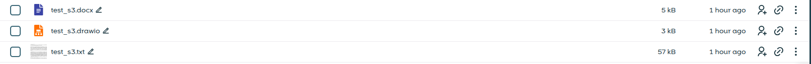

# I. Tải công cụ s3cmd
**s3cmd** là một công cụ dòng lệnh giúp thao tác với **S3 Storage** dễ dàng hơn.

## 1. Cài đặt s3cmd
```
sudo apt update
sudo apt install s3cmd -y
```

## 2. Cấu hình s3cmd
**Chạy lệnh sau để thiết lập:**
```
s3cmd --configure
```

**Nhập:**
```
Enter new values or accept defaults in brackets with Enter.
Refer to user manual for detailed description of all options.

Access key and Secret key are your identifiers for Amazon S3. Leave them empty for using the env variables.
Access Key: 
Secret Key: 
Default Region [US]:           
Use "s3.amazonaws.com" for S3 Endpoint and not modify it to the target Amazon S3.
S3 Endpoint [s3.amazonaws.com]: 

Use "%(bucket)s.s3.amazonaws.com" to the target Amazon S3. "%(bucket)s" and "%(location)s" vars can be used
if the target S3 system supports dns based buckets.
DNS-style bucket+hostname:port template for accessing a bucket [%(bucket)s.s3.amazonaws.com]: 

Encryption password is used to protect your files from reading
by unauthorized persons while in transfer to S3
Encryption password: 
Path to GPG program [/usr/bin/gpg]: 

When using secure HTTPS protocol all communication with Amazon S3
servers is protected from 3rd party eavesdropping. This method is
slower than plain HTTP, and can only be proxied with Python 2.7 or newer
Use HTTPS protocol [Yes]: Yes

On some networks all internet access must go through a HTTP proxy.
Try setting it here if you can't connect to S3 directly
HTTP Proxy server name: 

Test access with supplied credentials? [Y/n] Y
Please wait, attempting to list all buckets...
Success. Your access key and secret key worked fine :-)

Now verifying that encryption works...
Not configured. Never mind.

Save settings? [y/N] y
Configuration saved to '/root/.s3cfg'
```

# II. Cấu hình tích hợp với S3 
## 1. Download
```
git clone https://github.com/opencloud-eu/opencloud.git
```

## 2. Cấu hình
### 2.1. Di chuyển đến thư mục chứa các file cấu hình 
```
cd opencloud/deployments/examples/opencloud_full
```

### 2.2. Chỉnh sửa file chứa biến môi trường
```
vi .env
```

```
DECOMPOSEDS3=:decomposeds3.yml
# Configure the S3 storage endpoint. Defaults to "http://minio:9000" for testing purposes.
DECOMPOSEDS3_ENDPOINT=
# S3 region. Defaults to "default".
DECOMPOSEDS3_REGION=
# S3 access key. Defaults to "opencloud"
DECOMPOSEDS3_ACCESS_KEY=
# S3 secret. Defaults to "opencloud-secret-key"
DECOMPOSEDS3_SECRET_KEY=
# S3 bucket. Defaults to "opencloud"
DECOMPOSEDS3_BUCKET=
#
# For testing purposes, add local minio S3 storage to the docker-compose file.
# The leading colon is required to enable the service.
#DECOMPOSEDS3_MINIO=:minio.yml
```
- Trong trường hợp này ta không sử dụng MiniO nên bỏ dòng **DECOMPOSEDS3_MINIO=:minio.yml**

# III. Thử nghiệm
## 1. Tạo file trên OpenCloud


## 2. Kiểm tra trong S3
```
root@hunght-ubuntu-nvme:~# s3cmd ls s3://hn-opencloud
                          DIR  s3://hn-opencloud/a9f4cb7e-e3d4-4848-90d4-9c8e248942ae/
```

- Ta sẽ thấy 1 folder mới đã được tạo ra.

- Kiểm tra trong folder này ta sẽ thấy nhiều folder con chứa các file data bị phân mảnh.

### Success